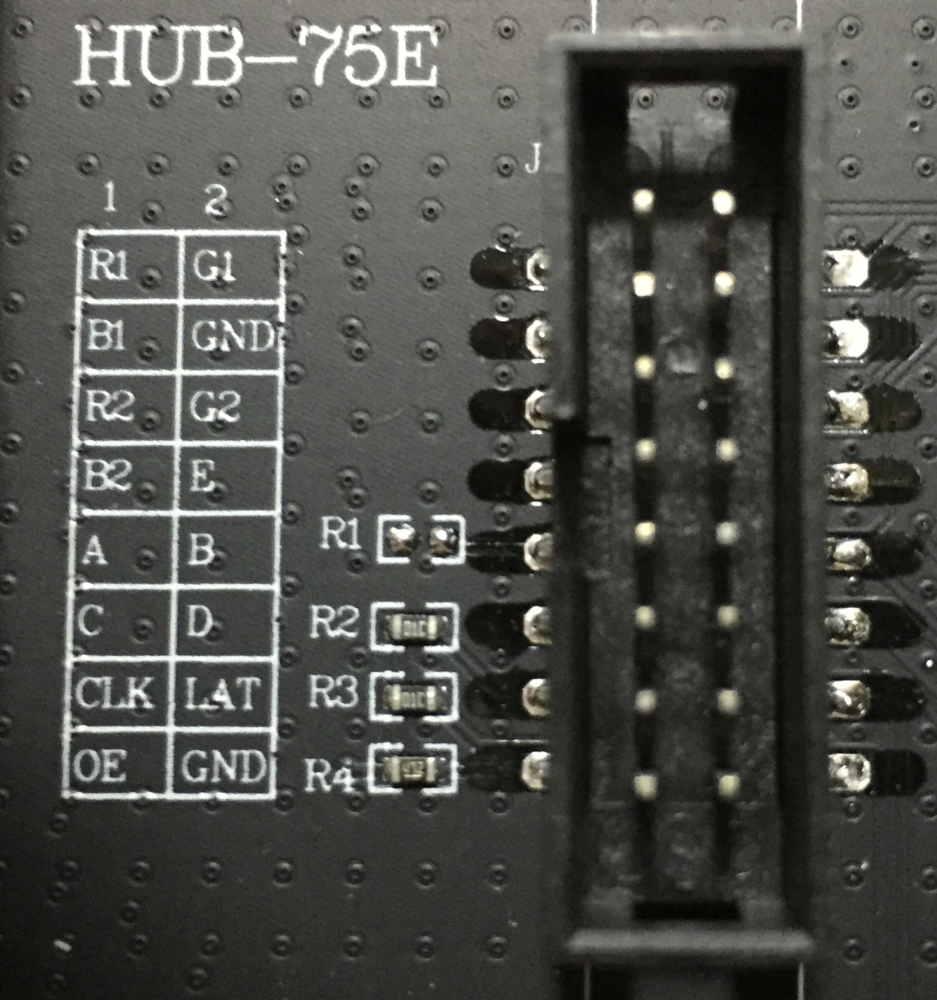

# HUB75E 点阵屏的使用

HUB75E 点阵屏是一块分辨率为 64*64，32 扫的点阵屏

## 关于32扫

32 扫即每刷新一次可第 i 行和第 i+32 行， 

## 接口定义



* RGB1 和 RGB2 为数据接口， 代表了两行数据线
* A, B, C, D, E 为地址接口， 最多可以表示32个地址
* Latch
* OE 为使能接口

## 单个点

该点阵屏为 rgb 三色， 因此控制一个点的颜色只需要三个bit即可，共可形成八种颜色。

## 单个点阵屏

因为地址最多寻址 32， 所以最多也只能选中 32 个不同的地址， 但是想要填充 64 行， 只能一个地址代表两行才能达到控制整个屏幕的效果， 所以才有 32 扫，即地址 i 能够选中第 i 和第 i+32 行， 这样便能一次发送两行数据， 很好的解决了地址线不够的问题。

### 点亮流程

1. 需要准备一个 buf 来存储行数据， 单个点阵屏只需要 64 bytes即可， 每个 byte 需要其中 6 位来存储 rgb1 rgb2 的数据。
2. 将数据通过 SPI 发送出去
3. latch 脚拉
4. latch 脚拉低
5. 选中地址, 地址为 5 位, A B C D E 由低位到高位
6. 使能 oe
7. 返回步骤1, 循环直到所有地址都扫描了一次


## 多个点阵屏

多个点阵屏刷新顺序根据其排列顺序而不同例如为 Z 字型排列，

### 点亮流程

## display 代码

```c
int hub75e_display(int core)
{
    if(!(hub75e_obj&&image)) return -1;

    int y, t, x;
    uint16_t vertical_boards = hub75e_obj->height / HEIGHT_PER_BOARD;
    uint16_t line_buf_size = hub75e_obj->width * vertical_boards;
    uint16_t *rgb444 = (uint16_t *)malloc(hub75e_obj->width * hub75e_obj->height * sizeof(uint16_t));
    uint32_t *line_buffer = (uint32_t *)malloc(line_buf_size * sizeof(uint32_t));
    volatile spi_t *spi_handle = spi[hub75e_obj->spi];
    
    // rgb565 -> rgb444
    for (y = 0; y < hub75e_obj->height; y++)
    {
        for (x = 0; x < hub75e_obj->width; x++)
        {
            uint16_t rgb565_yx = *(image + y * hub75e_obj->width + x);
            *(rgb444 + y * hub75e_obj->width + x) = rgb565_to_rgb444[SWAP_TO_MP16(rgb565_yx)];
        }
    }
    
    // 每张图刷新 16 次, 可以达到用占空比控制的效果, 16 为 4 位所能表示的全部色彩
    for (t = 0; t < 16; t++)
    {
        // 32 扫, 每次将 y 和 y+32 行填入 linebuffer       
        for (y = 0; y < SCAN_TIMES; y++)
        {
            // 每次发送一个 linebuffer ， linebuffer 大小为 每块的行宽*一行的块数*竖直的板子数
            for (int bs = vertical_boards; bs  > 0; bs--)//刷新第 bs 行的板子， 板子总行数为 vertical_boards
            {
                // line_buffer 填充起点
                int line_buf_base_index = ((vertical_boards - bs)*hub75e_obj->width);
                if(bs % 2 ==0){// 垂直第偶数行板子, 刷新顺序从下到上， 从右至左
                    // 填入 linebuffer 的 img 行号
                    int img_line_num = bs * HEIGHT_PER_BOARD - y - 1;
                    // 填入 linebuffer 的 img 出发点
                    int img_line_begin = img_line_num * hub75e_obj->width;
                    // 填入 linebuffer 的 img 行加 32 扫, 因为从下往上
                    int img_line_scan_begin  = (img_line_num - SCAN_TIMES) * hub75e_obj->width;
                    // 需要填充的 linebuffer 的结束点下标
                    int line_buf_end_index = line_buf_base_index + hub75e_obj->width - 1;
                    for(int  x = hub75e_obj->width - 1; x >= 0; x--)
                    {
                        // 编码每行的点， 一次两行， 高三位: 7(r1),6(g1),5(b1)为第 img_line_num 行), 后三位: 4(r2),3(g2),2(b2) 为第 img_line_num - SCAN_TIMES 行)
                        line_buffer[line_buf_end_index - x] = ((pwm_table[t][*(rgb444 + img_line_begin + x)]) | \
                                        pwm_table[t][*(rgb444 + img_line_scan_begin + x)] >> 3);
                    }
                }else{// 垂直第奇数块所在行, 刷新顺序从上到下， 从左至右
                    // 填入 line-buffer 的 img 行号
                    int img_line_num = (bs - 1) * HEIGHT_PER_BOARD + y;
                    // 当前显示 img 行的出发点
                    int img_line_begin = img_line_num * hub75e_obj->width;
                    // 填入 linebuffer 的 img 行加 32 扫
                    int img_line_scan_begin = (img_line_num + SCAN_TIMES) * hub75e_obj->width;
                    // 显示第 bs 块板的第 y 行
                    for(int  x = 0; x < hub75e_obj->width; x++)
                    {
                        // 编码每行的点，高三位: 7(r1),6(g1),5(b1)为第 img_line_num 行), 后三位: 4(r2),3(g2),2(b2) 为第 img_line_num + SCAN_TIMES 行)
                        line_buffer[x+line_buf_base_index] = ((pwm_table[t][*(rgb444 + img_line_begin + x)]) | \
                                        pwm_table[t][*(rgb444 + img_line_scan_begin + x)] >> 3);
                    }
                }
            }            
            fill_line(hub75e_obj, spi_handle, line_buffer, y, line_buf_size); // 发送行数据
        }
    }   
    free(line_buffer);
    free(rgb444);
    return 0;
}
```