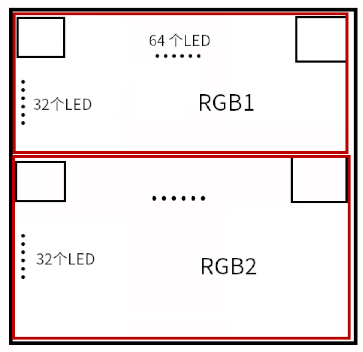
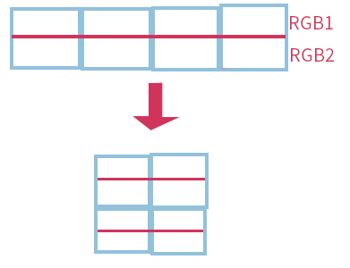
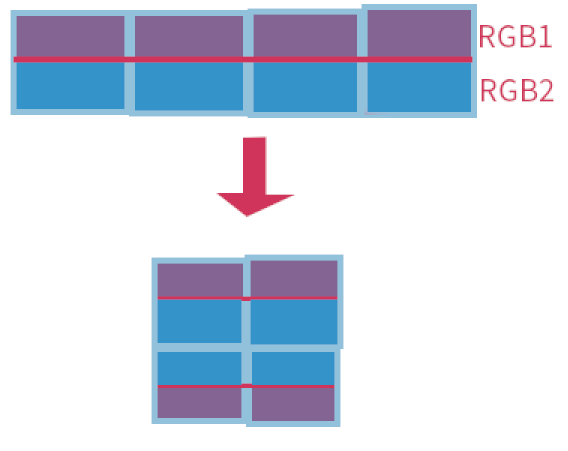

# HUB75E 点阵屏的使用

HUB75E 点阵屏是一块分辨率为 64*64，32 扫的点阵屏， 为了方便解释定义 SINGLE_WIDTH = 64 为单个屏幕的宽， SINGLE_HEIGHT = 64 位单个屏幕的高， SCAN_MODE = 32 为扫描模式

## 关于32扫

32 扫即选中 i 地址刷新的是第 i 行和第 i+SCAN_MODE 行， 这样刚好可以用 32 个地址刷新 64 行。

## 接口定义


* RGB1 和 RGB2 为数据接口， 代表了两行数据线
* A, B, C, D, E 为地址接口， 最多可以表示32个地址
* Latch 脚，不清楚有什么用
* OE 为使能接口

## 单个点

该点阵屏为 rgb 三色， 因此控制一个点的颜色只需要三个bit即可，共可形成八种颜色。

## 单个点阵屏

地址选中 0 开始， 每次点亮两行， 到地址为 SCAN_MODE 即可完成整块屏幕的刷新

### 分析



* 整个点阵屏分为上下两部分， 每部分 SINGLE_HEIGHT/2 行。
* 上半部分颜色数据线为 R1,G1, B1， 下半部分为 R2，G2，B2

### 扫描一次

例如扫描第 0x11 行和第 0x11 + SCAN_MODE 行

* 填充 linebuffer，将 img 第 0x11 行填入 RGB1，第 0x11 + SCAN_MODE 行填入 RGB2.
* 选中地址 0x11, 此时调用 set_addr 函数设置  A, B, C, D, E 选中 0x11。
* 地址选中函数示例如下:

```c
static inline void hub75e_set_addr(hub75e_t* hub75e_obj, uint8_t addr)
{
    my_set_gpiohs(hub75e_obj->a_gpio, addr & 0x01);
    my_set_gpiohs(hub75e_obj->b_gpio, (addr & 0x02) >> 1);
    my_set_gpiohs(hub75e_obj->c_gpio, (addr & 0x04) >> 2);
    my_set_gpiohs(hub75e_obj->d_gpio, (addr & 0x08) >> 3);
    my_set_gpiohs(hub75e_obj->e_gpio, (addr & 0x10) >> 4);
}
```

### 点亮单个屏

1. 需要准备一个长度为 SINGLE_WIDTH bytes 的 linebuf 来存储行数据， 每个 byte 其中 6 位来存储 rgb1(3bit) rgb2(3bit) 的数据， 这样刚好可以表示 i，i+SCAN_MODE 两行。
2. 将数据通过 SPI 发送出去
3. latch 脚拉
4. latch 脚拉低
5. 选中地址, 地址为 5 位, A B C D E 由低位到高位
6. 拉高 OE 使能
7. 返回步骤1, 循环直到所有地址都扫描了一次

## 多个点阵屏

### 分析

1. 多个点阵屏可以看做时一个长度为：SINGLE_WIDTH*屏幕个数，高度为： SINGLE_HEIGHT 的长条形点阵屏
2. 该点阵屏上半部分颜色由 RGB1 控制，下半部分由 RGB2 控制。
3. 长条形点阵屏弯折即可拓展成高度大于 64 的矩阵屏，如图所示:
4. 这样做只是重新排列了一次而已，控制方式仍然是以单个长条型点阵屏控制，只是需要注意发送数据的顺序



### 点亮流程

这个随摆放方式不同而不同， 我使用的是 S 型摆放， 这里有一个问题是第偶数行点阵屏会是倒过来的， 总之先发送的肯定是排在最后的点阵屏, 以下图为例就是右下角那块。



以上排列方式代码如下：

```C
int hub75e_display(int core)
{
    if(!(hub75e_obj&&image)) return -1;

    int y, t, x;
    uint16_t vertical_boards = hub75e_obj->height / HEIGHT_PER_BOARD;
    uint16_t line_buf_size = hub75e_obj->width * vertical_boards;
    uint16_t *rgb444 = (uint16_t *)malloc(hub75e_obj->width * hub75e_obj->height * sizeof(uint16_t));
    uint32_t *line_buffer = (uint32_t *)malloc(line_buf_size * sizeof(uint32_t));
    volatile spi_t *spi_handle = spi[hub75e_obj->spi];
    
    // rgb565 -> rgb444
    for (y = 0; y < hub75e_obj->height; y++)
    {
        for (x = 0; x < hub75e_obj->width; x++)
        {
            uint16_t rgb565_yx = *(image + y * hub75e_obj->width + x);
            *(rgb444 + y * hub75e_obj->width + x) = rgb565_to_rgb444[SWAP_TO_MP16(rgb565_yx)];
        }
    }
    
    // 每张图刷新 16 次, 可以达到用占空比控制的效果, 16 为 4 位所能表示的全部色彩
    for (t = 0; t < 16; t++)
    {
        // 32 扫, 每次将 y 和 y+32 行填入 linebuffer       
        for (y = 0; y < SCAN_TIMES; y++)
        {
            // 每次发送一个 linebuffer ， linebuffer 大小为 每块的行宽*一行的块数*竖直的板子数
            for (int bs = vertical_boards; bs  > 0; bs--)//刷新第 bs 行的板子， 板子总行数为 vertical_boards
            {
                // line_buffer 填充起点
                int line_buf_base_index = ((vertical_boards - bs)*hub75e_obj->width);
                if(bs % 2 ==0){// 垂直第偶数行板子, 刷新顺序从下到上， 从右至左
                    // 填入 linebuffer 的 img 行号
                    int img_line_num = bs * HEIGHT_PER_BOARD - y - 1;
                    // 填入 linebuffer 的 img 出发点
                    int img_line_begin = img_line_num * hub75e_obj->width;
                    // 填入 linebuffer 的 img 行加 32 扫, 因为从下往上
                    int img_line_scan_begin  = (img_line_num - SCAN_TIMES) * hub75e_obj->width;
                    // 需要填充的 linebuffer 的结束点下标
                    int line_buf_end_index = line_buf_base_index + hub75e_obj->width - 1;
                    for(int  x = hub75e_obj->width - 1; x >= 0; x--)
                    {
                        // 编码每行的点， 一次两行， 高三位: 7(r1),6(g1),5(b1)为第 img_line_num 行), 后三位: 4(r2),3(g2),2(b2) 为第 img_line_num - SCAN_TIMES 行)
                        line_buffer[line_buf_end_index - x] = ((pwm_table[t][*(rgb444 + img_line_begin + x)]) | \
                                        pwm_table[t][*(rgb444 + img_line_scan_begin + x)] >> 3);
                    }
                }else{// 垂直第奇数块所在行, 刷新顺序从上到下， 从左至右
                    // 填入 line-buffer 的 img 行号
                    int img_line_num = (bs - 1) * HEIGHT_PER_BOARD + y;
                    // 当前显示 img 行的出发点
                    int img_line_begin = img_line_num * hub75e_obj->width;
                    // 填入 linebuffer 的 img 行加 32 扫
                    int img_line_scan_begin = (img_line_num + SCAN_TIMES) * hub75e_obj->width;
                    // 显示第 bs 行板的第 y 行
                    for(int  x = 0; x < hub75e_obj->width; x++)
                    {
                        // 编码每行的点，高三位: 7(r1),6(g1),5(b1)为第 img_line_num 行), 后三位: 4(r2),3(g2),2(b2) 为第 img_line_num + SCAN_TIMES 行)
                        line_buffer[x+line_buf_base_index] = ((pwm_table[t][*(rgb444 + img_line_begin + x)]) | \
                                        pwm_table[t][*(rgb444 + img_line_scan_begin + x)] >> 3);
                    }
                }
            }            
            fill_line(hub75e_obj, spi_handle, line_buffer, y, line_buf_size); // 发送行数据
        }
    }   
    free(line_buffer);
    free(rgb444);
    return 0;
}
```